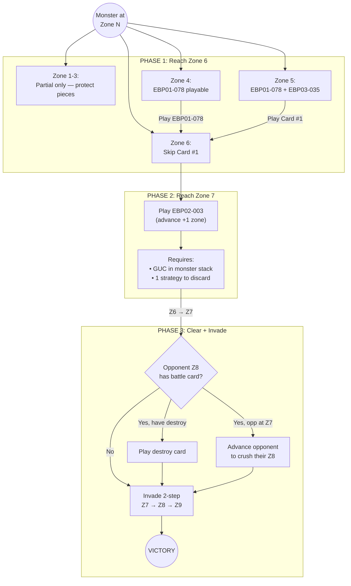
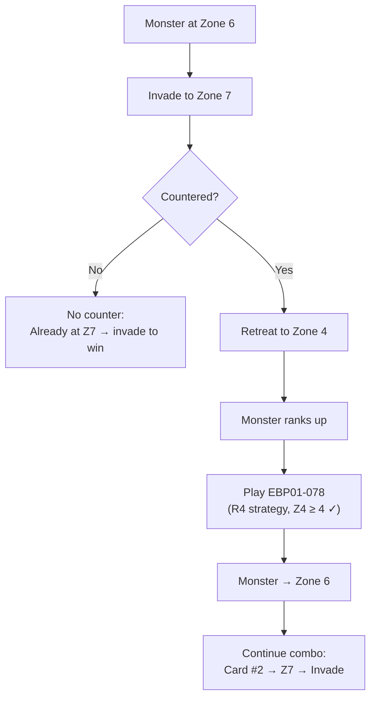
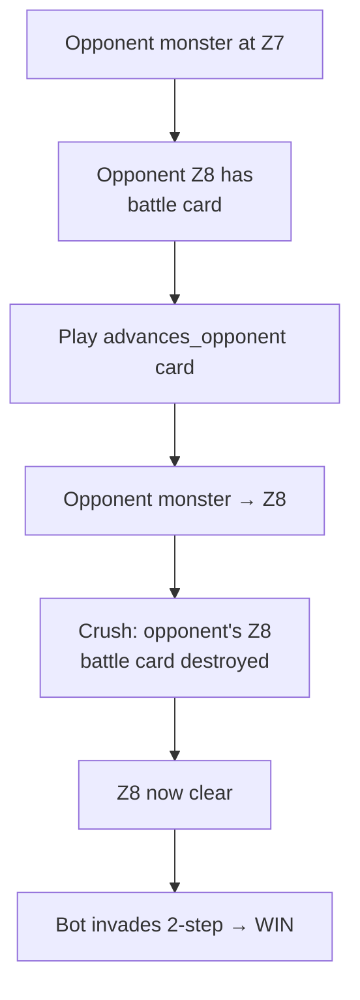
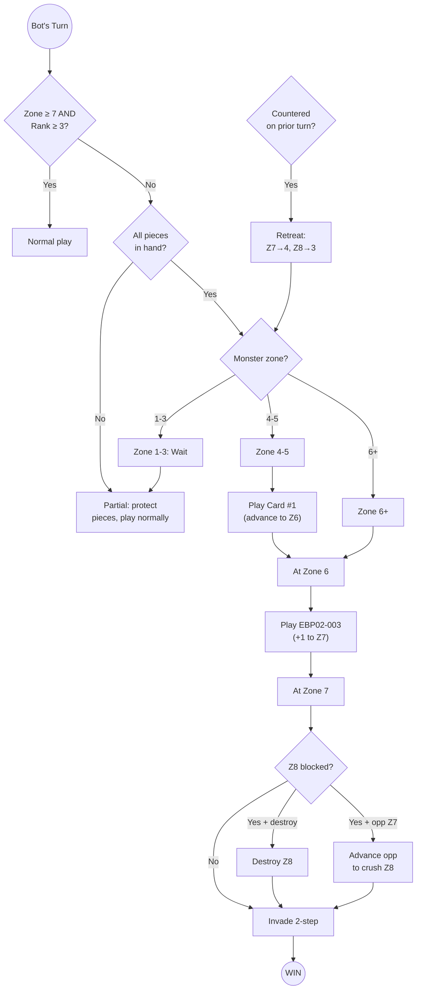

# Shin Combo — Single-Turn Win Paths

The Shin Combo is a multi-card win path that achieves victory through invasion in a single turn.

## Core Sequence

1. Get monster to zone 6 (via Card #1, or already there)
2. Advance monster from zone 6 to zone 7 (via Card #2 — EBP02-003)
3. Clear opponent zone 8 if blocked (via destroy card or advance-opponent crush)
4. Invade with a 2-step card: zone 7 → zone 8 → zone 9 = **victory**

## Card Roles

| Role | ID | Name | Type | Rank | Effect | Reliability | Extra Cost |
|---|---|---|---|---|---|---|---|
| Card #1 | EBP01-078 | Godzilla Attacks | Strategy | 4 | Advance to zone 6 (guaranteed) | 100% at zone 4+ | None |
| Card #1 | EBP02-014 | Cabinet Helicopter | Battle | 6 | Mill top deck; if monster, advance to zone 6 | ~20-50% (deck monster ratio) | None |
| Card #1 | EBP03-035 | Satsuma | Battle | 5 | Same column as opp monster: discard strategy, advance to zone 6 | 90% (column + strategy) | 1 strategy discard |
| Card #2 | EBP02-003 | Godzilla(2016) 2nd Form | Monster | 2 / Burst 3 | If GUC in stack, discard strategy to advance +1 | 100% | 1 strategy discard |
| Destroy | (various) | — | Battle/Strategy | Varies | Cards with `destroys_zone` tag | Varies | Varies |
| Invasion | (various) | — | Any | — | Cards with `invasion_icon >= 2` | 100% | Discarded on use |

## Playability Constraints

- **Strategy cards**: rank <= own monster zone (e.g. rank 4 needs zone 4+)
- **Battle cards**: rank <= opponent's monster zone
- **EBP02-003**: playable from monster rank 2 (same rank) or rank 3 (burst); GUC must be active monster or in stack
- **Invasion**: requires a card in hand with `invasion_icon > 0`

## Primary Combo Path



## Counter-Retreat Strategy

When countered, the monster retreats: **Z6→5, Z7→4, Z8→3**

The bot deliberately allows invasion to zone 7 when holding EBP01-078 (rank 4 strategy), because counter-retreat to zone 4 makes the strategy playable:



## Advance-Opponent Crush Path

Instead of a destroy card, advance the opponent's monster into zone 8 to crush their own battle card:



**Note**: Advancing opponent to zone 6+ without crushing is penalized heavily (-100 score) — only allowed when it crushes a card or enables a win.

## Starting Zone Analysis

```
Zone 1-3:  Cannot execute. Card #1 strategies unplayable (rank > zone).
           Partial detection only — protect combo pieces.
           EBP02-014 (Battle R6) needs opponent at zone 6+.

Zone 4:    FIRST VIABLE ZONE for EBP01-078 (Strategy R4 ≤ Z4).
           Full combo: Card #1 → Z6, Card #2 → Z7, (destroy?), invade → WIN
           Requires 3-4 cards.

Zone 5:    EBP01-078 + EBP03-035 both viable.
           EBP03-035 needs opponent at zone 5+ and column alignment.

Zone 6:    OPTIMAL. Skip Card #1 entirely.
           Only need: Card #2 + (destroy?) + invasion = 2-3 cards.

Zone 7+:   If rank ≥ 3: combo not needed (normal win path).
           If rank < 3: can be pushed back — keep collecting pieces.
```

## Card #1 Variant Comparison

```
                    EBP01-078           EBP02-014           EBP03-035
                    Godzilla Attacks    Cabinet Helicopter   Satsuma
Type:               Strategy            Battle               Battle
Rank:               4                   6                    5
Playable when:      Own zone ≥ 4        Opp zone ≥ 6         Opp zone ≥ 5
Reliability:        100% (guaranteed)   ~20-50% (deck RNG)   90% (column dep.)
Extra cost:         None                None                 1 strategy discard
Counter-retreat:    Z7→4 enables it     No (battle card)     No (battle card)
Best scenario:      Zone 4-5, safe      Late game, monster-  Column aligned,
                    guaranteed path     heavy deck            strategy in hand
```

## Full Decision Tree



## Viability Scoring

| Factor | Condition | Score |
|---|---|---|
| Proximity | Zone 3 | +50 |
| Proximity | Zone 4 | +70 |
| Proximity | Zone 5 | +90 |
| Proximity | Zone 6 | +100 |
| Opponent pressure | Zone 1-4 (low) | +20 |
| Opponent pressure | Zone 5-6 (medium) | +0 |
| Opponent pressure | Zone 7 (high) | -20 (halved if can counter) |
| Opponent pressure | Zone 8 (critical) | -40 (halved if can counter) |
| Zone 8 clear | No destroy needed | +20 |
| Hand flexibility | 5+ remaining after combo | -10 |
| Hand flexibility | 3-4 remaining | -15 |
| Hand flexibility | 1-2 remaining | -25 |
| Hand flexibility | 0 remaining | -30 |
| CP gap | ≥ 10000 behind | -30 |
| CP gap | ≥ 5000 behind | -15 |
| Invasion blocked | Effect blocks own invasion | -100 |

Full state minimum score bonus: **100** (combo cards always outprioritize normal plays).

## Invasion Suppression

| Condition | Suppressed? | Reason |
|---|---|---|
| Both players at zone 1 | Yes | Wait to see opponent's move |
| Opponent zone 1-4, bot 1+ zones ahead | Yes | Pace-match, don't overextend |
| Bot has rank 4 strategy, invading to Z7 | **No** | Counter-retreat to Z4 enables strategy |
| Win available (zone 7+, Z8 clear) | **Never** | Winning is top priority |

## Effect Cost Validation

EBP02-003 requires discarding a strategy card. The combo reserves a non-combo strategy card (`cost_reserve_idx`) to ensure the cost can be paid without consuming another combo piece (like a strategy that's also the invasion card).

If no spare strategy exists in hand, the combo stays **partial** even with all other pieces present.
